# 微软云搭梯子免费撸13个月云主机教程
先看一下微软官方的活动介绍 https://azure.microsoft.com/zh-cn/free/


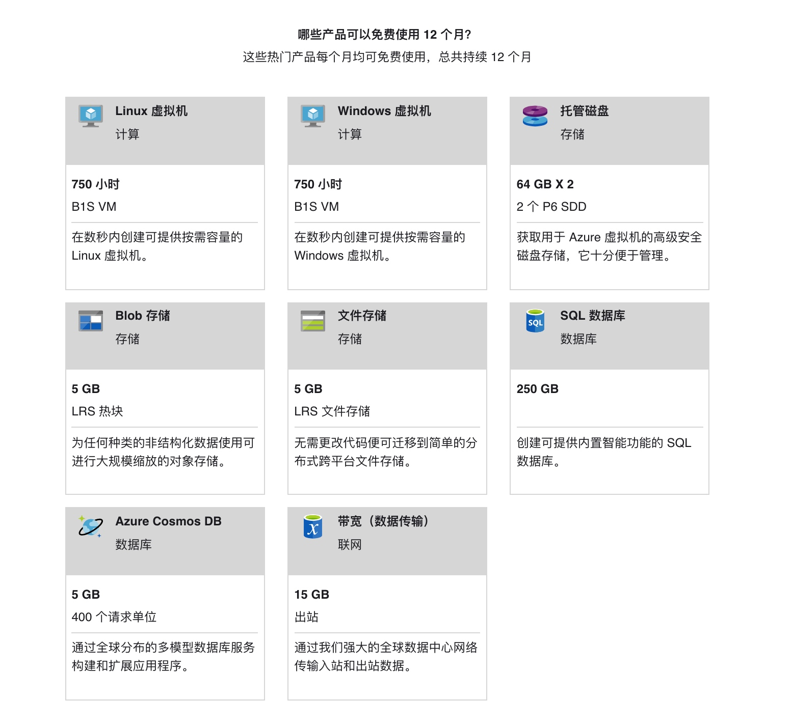

从图上可以看出创建免费账户后微软会送给我们200刀，然后在一个月内随便使用，并且一个月时间到期后吧免费账户升级为订阅账户，又可以免费使用12个月，免费使用的服务见第二张图。

现在我们登陆Azure控制面板页面：https://portal.azure.com （没有微软账号的朋友需要自己去注册后进行登陆）

## 绑定银行卡账户
在使用Azure云之前需要绑定一张具有一张支持visa或者mastercard的外币信用卡
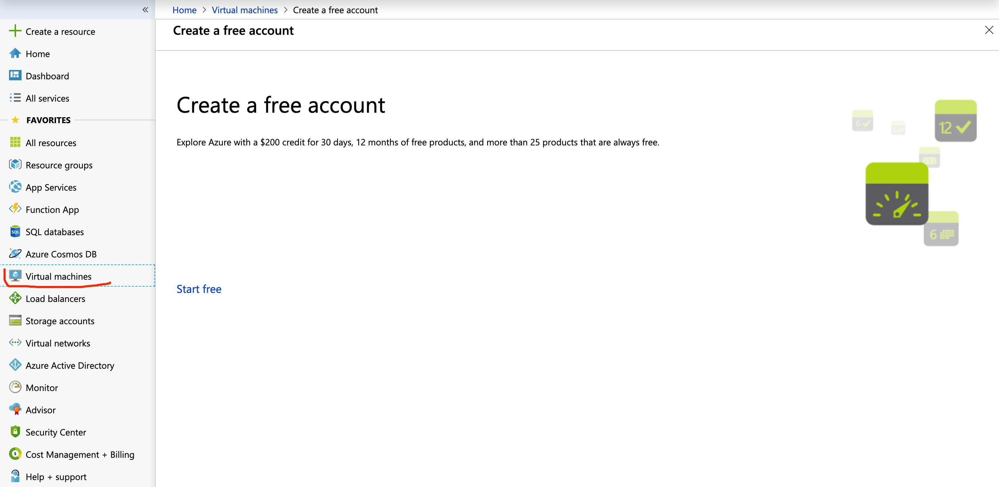

点击页面右边菜单Virtual machines再点击页面中间的按钮，见图
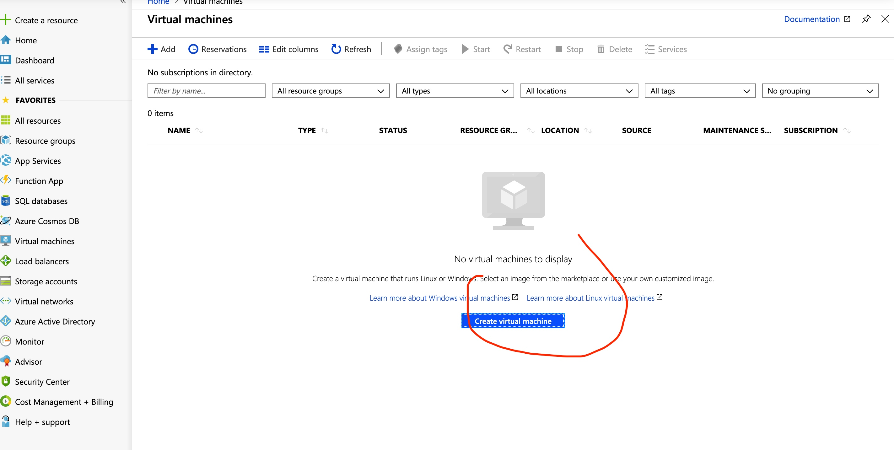


这时会引导绑定邮箱、手机号、银行卡（以后的所有花费都会在这张卡里面扣除）
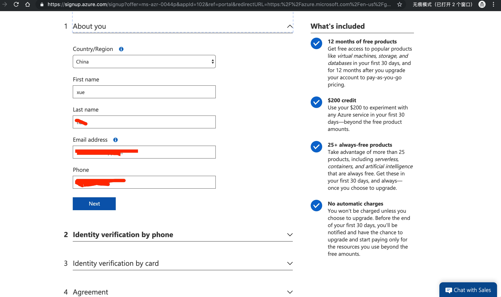
看图有四个步骤，第一步：填写邮箱、手机号点击Next后进入第二步，会给我们手机发送验证码，这里需要填入才能进入下一步，第三部填写银行卡信息，这里我忘了所有支持的支付方式，但是Visa和mastercard肯定支持，我当时就是用mastercard广发信用卡注册的，这里跟着步骤走，如果顺利的话账号绑定银行卡成功就可以创建vm免费使用了。

## 创建VM虚礼机实例
这里我们需要按照图2所列免费产品来创建，这里有坑，如果选择错误等一个月的免费时间到期后，我们创建的项目如果没有按照图2所列12个月的免费产品来创建的话，到时候会被扣钱，有钱的同学可以无视！
这里我们回到Azure控制面板点击页面右边菜单选项Virtual machines，然后点击Add
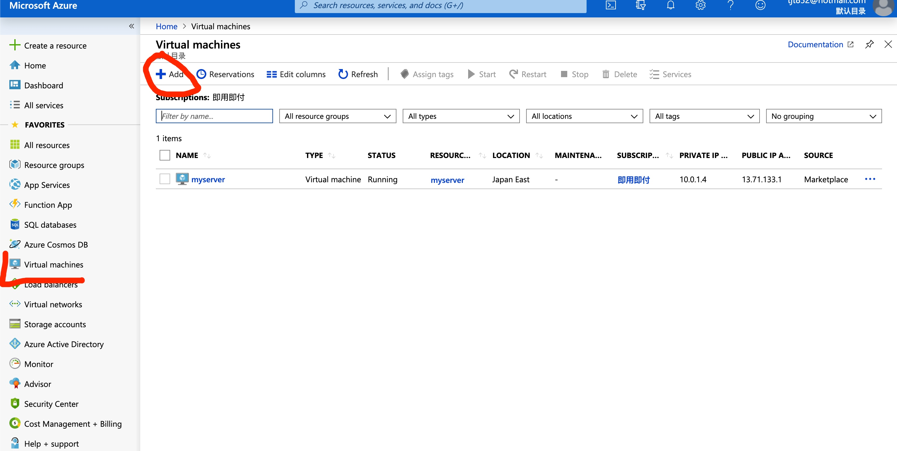

看下图
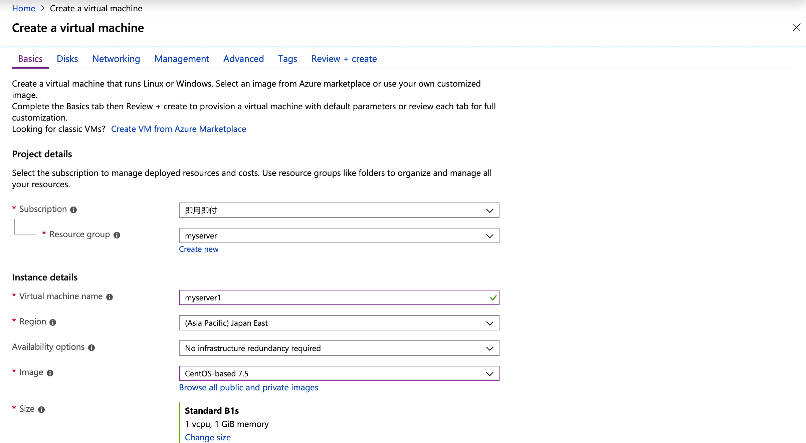
Resource group：没有的Create new下
Region：这里我选择日本，我使用了三个月了，总体来说比较流畅
Virtual machine name：这里去一个vm名称，myserver1
Avaliability options：这里默认就行，见图
Image：我喜欢CentOS，不知道选什么的按我的来
Size：选择的时候记住了一定要选择B1s，一定要选择B1s,一定要选择B1s,见下图

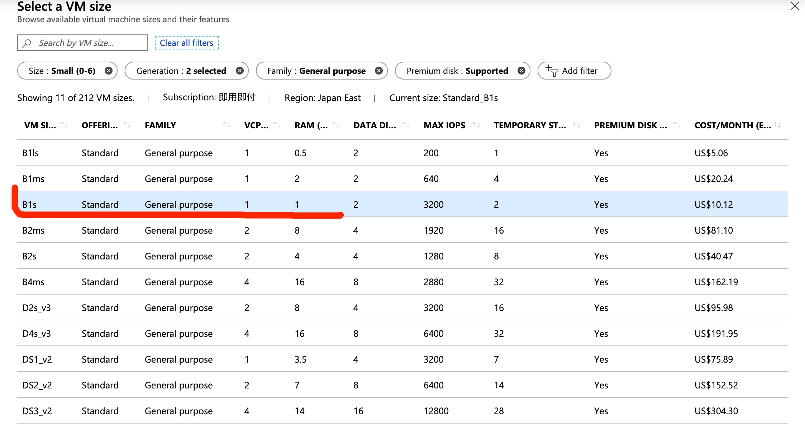

接着往下设置VM账号
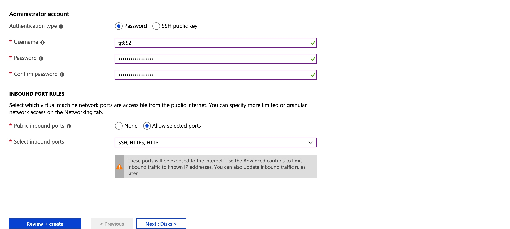

Authentication type: 建议选择Password这样换了电脑也能登陆
Username: 自己填
Password : 这里密码要包含大小写字母和特殊符号，比如：Test#12345678
Public inbound ports：选择Allow selected ports
Select inbound ports：下拉选中SSH(远程命令行登陆用的)、HTTPS、HTTP（这两个我是有网站部署在VM上的，不需要的同学可以忽略）
接着点击Next:Disks >
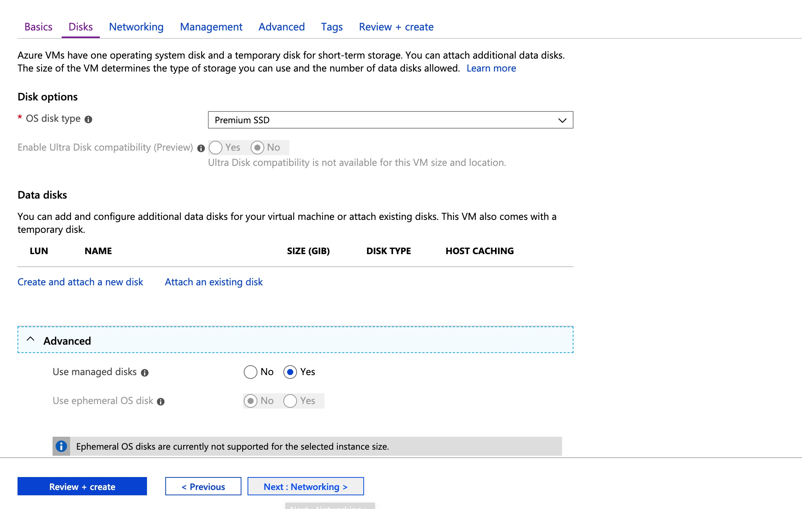
所有选项都默认就好了，磁盘选择Premium SSD就好，接着点击：Next:Networking

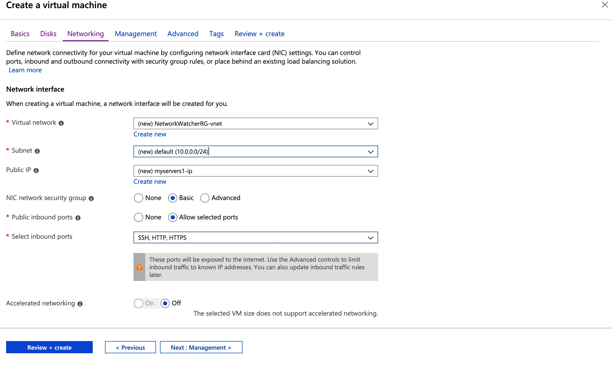
这里默认就好

Public IP：这里建议更改下，点击Create new
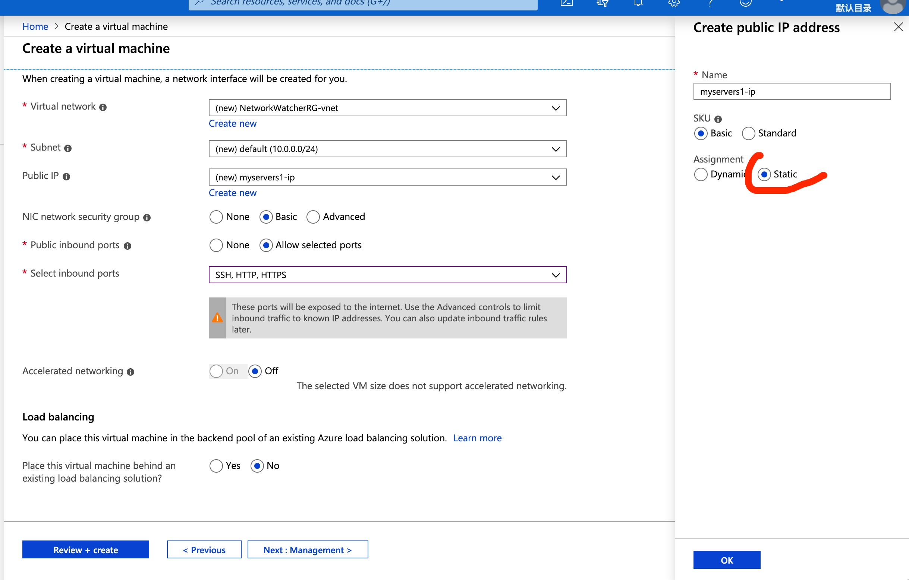
选择IP为Static静态的，这样我们的IP就不会在VM重启后变更。（静态IP可能收费，不在12个月免费项里，但是经本人使用三个月来暂未发现扣费现象）点击：Next:Management > 

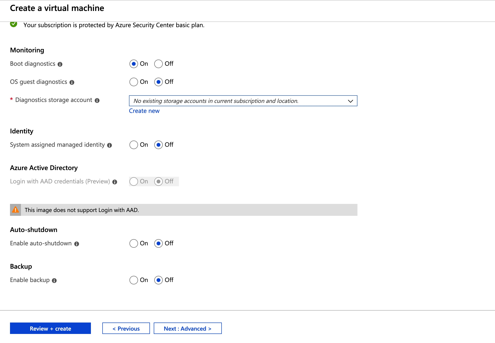
所有选项默认即可，点击Next:Advanced >

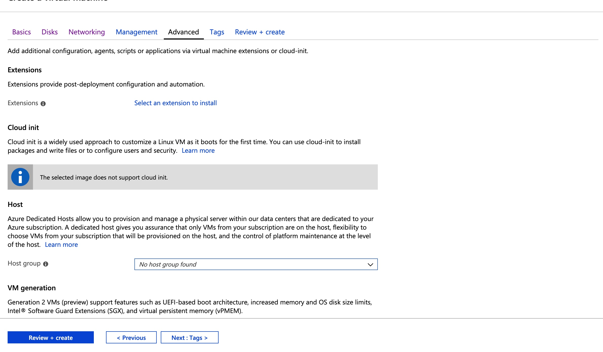
默认即可，点击Next:Tags >

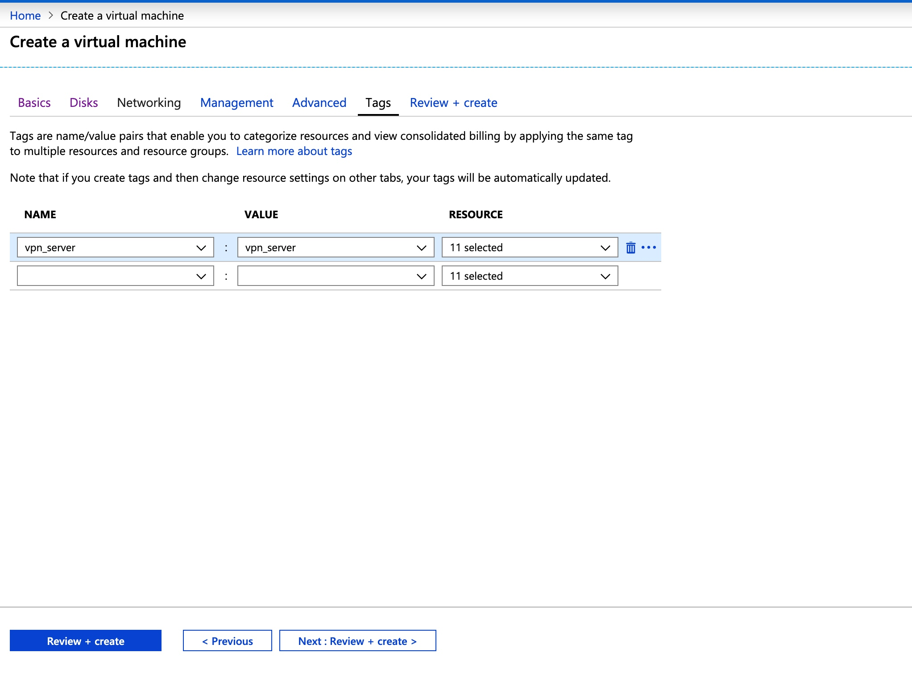
这里去一个标签名，好后面结算的时候统计费用，当然我们这免费，不会有扣费情况，但可以让我们了解使用超支后的收费详情。点击：Next:Revice + create > 接下来会有创建配置的预览页面，页面有配置信息和预算收费等，不用管 点击：Create 按钮即可。

接下来需要更改我们的创建的VM虚礼机磁盘大小，因为免费选项里只支持p6类型的磁盘，我们创建时系统盘默认是30GB的磁盘，类型是p4,如果不更改会收费，笔者在此此处吃过亏并就此问题跟微软云客服进行过电话和邮件沟通，此处我们把创建好的VM停止掉
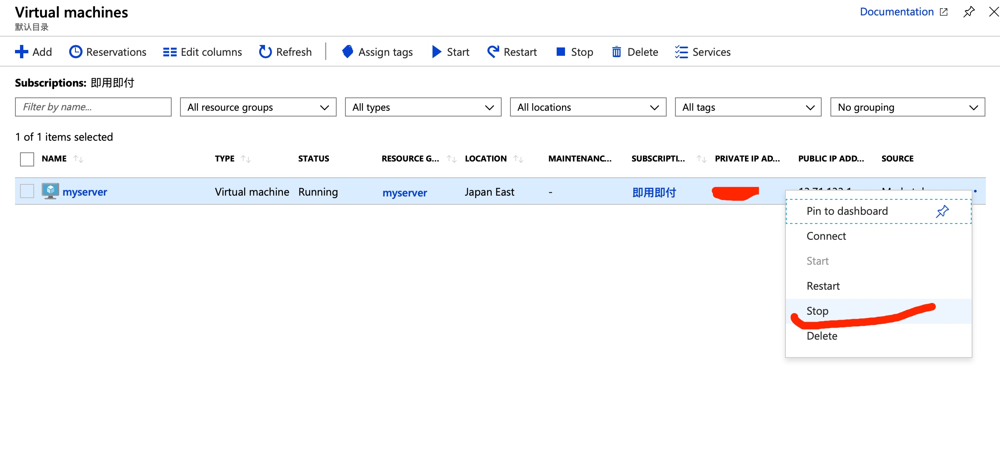

等停止后，我们选择vm点击进去，看下图
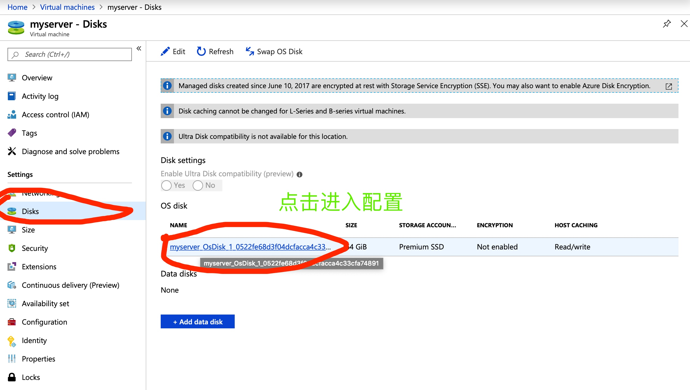

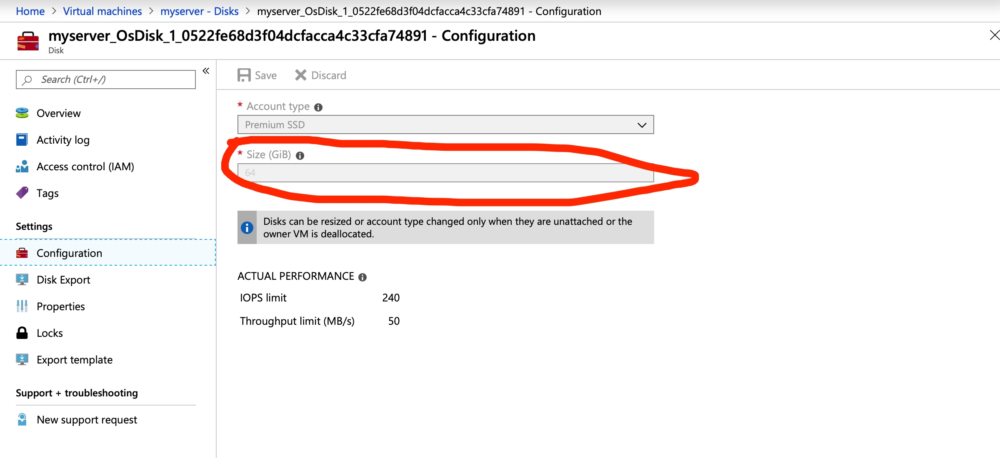
修改为64即可，此处我的vm没有真停，只是做演示用。好了，到这里我们就已经可以享受13个月的免费vm了，不过需要在首月200美金账户到期后，需要吧免费账户升级为订阅账户才能接着使用接下来的12个月服务，一月免费账户快到期的时候控制面板右上角会有消息提示，到时候可以留意一下，这里就不放图说明了，到时候升级时只用选择“即用即付”应该是最后一项，不要选择任何收费包月或者包年的选项，不要选择，不要选择！

### 开放SSR和L2TP VPN网络端口
* 开放SSR端口

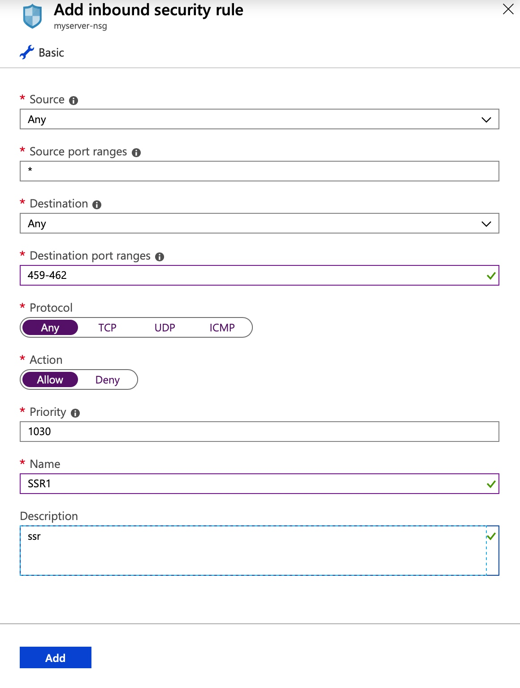
见图设置即可，这里设置459-462，是因为笔者之前在google cloud上面使用ssr的时候会偶尔遇到端口被墙封了的情况，所以这里里面设置一个范围，端口被封了，或者跑不通的时候，可以立刻尝试换一个端口快速重启跑起SSR服务。

* 开放VPN端口
这里又不想装的同学可以忽略这部分继续往下看
这里我们继续同上步骤再Add inbound port rule
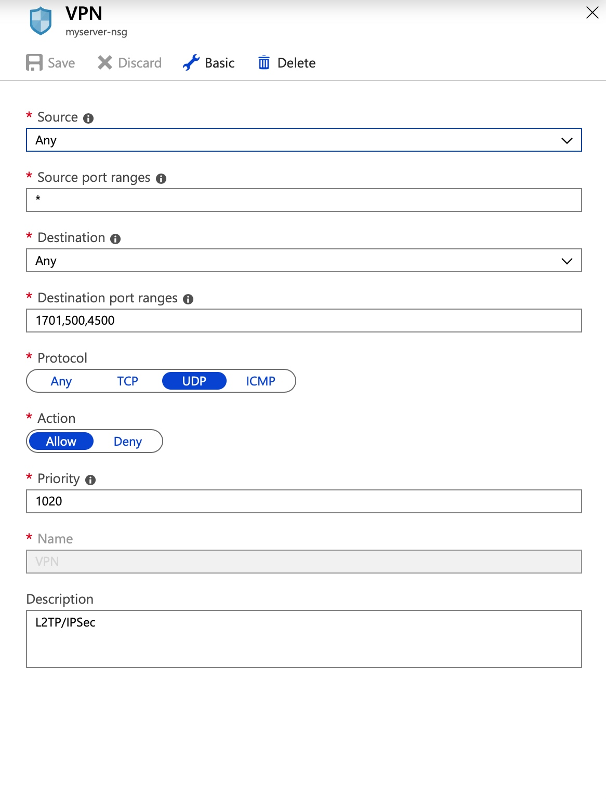
这里是我们接下来要安装的L2TP/IPSec协议的vpn所使用到的所有端口，照着配置即可！


## 搭建ssr多用户版本

找到我们的公共IP，在控制台终端使用ssh连接我们的服务器，终端输入：
``` 
ssh username@13.xx.xx.xx
```
第一次登陆会询问是否允许，yes或者Y即可，然后输入我们创建vm时设置的密码
具体搭建方式请参考此链接：https://github.com/shadowsocksr-backup/shadowsocks-rss/wiki/Server-Setup(manyuser-with-mudbjson)
在这里我也会重复一遍安装方式请接着往下看：
输入如下命令：
```
sudo su #输入我们的密码，这里获取root权限，防止后面的操作出错
yum install python-setuptools && easy_install pip
yum install git
cd ~
mkdir git && cd git
git clone https://github.com/shadowsocksr-backup/shadowsocksr.git

```
此时会在当前目录生成一个shadowsocksr文件夹
```
ls #查看
cd ~/git/shadowsocksr #进入此目录
bash initcfg.sh
vi userapiconfig.py #修改文件内容，见下图
```
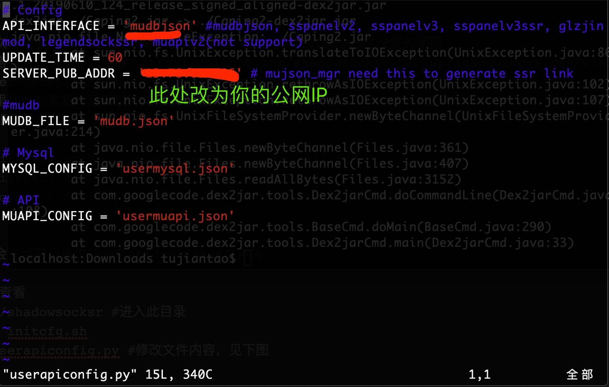
照着上图修改即可，修改后按 [esc] 键再按 [:] 键 然后输入wq 回车即可

记下来用命令添加SSR账户
```
python mujson_mgr.py -h #查看命令的使用方式

python mujson_mgr.py -a -u myssr -p 450 -k myssr@test123 -m rc4-md5 -O origin -o plain

```
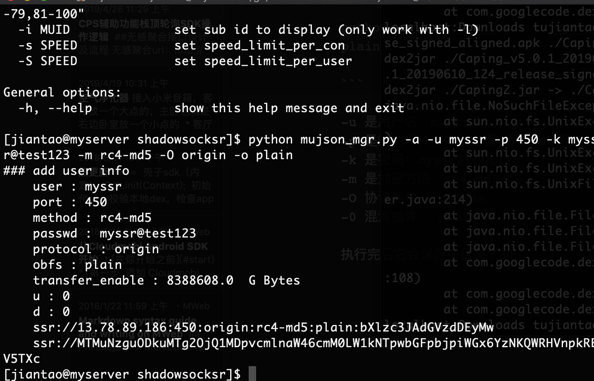

-u 是用户名：myssr
-p 是端口号，在本篇上面[开放SSR端口]处所设置的端口范围内取一个，这里是：460
-k 是密码：myssr@test123
-m 是加密方法：rc4-md5
-O 协议插件 ：origin
-0 混淆插件 ：plain

执行完后我们的ssr用户就添加成功了，它会保存在目录下的mudb.json文件里，好奇的可以打开文件查看:
```
vi mudb.json #当然你也可以直接在此文件中增加一个用户
```

后台运行（无log，ssh窗口关闭后也继续运行）

./run.sh

后台运行（输出log，ssh窗口关闭后也继续运行）

./logrun.sh

后台运行时查看运行情况

./tail.sh

停止运行

./stop.sh

注：通过脚本运行默认日志会保存在根目录的ssserver.log，可手动查看。

好了到这里我们的ssr服务已经成功启动了，我们可以试试通过安装客户端测试使用了

android客户端此处下载：https://github.com/shadowsocksr-backup/shadowsocksr-android/releases

mac客户端此处下载：https://github.com/shadowsocksr-backup/ShadowsocksX-NG/releases

* 测试下ssr的连接，我这里用mac来做测试
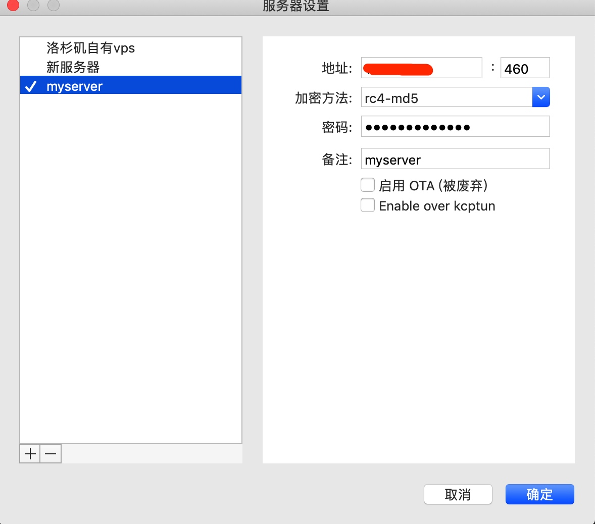
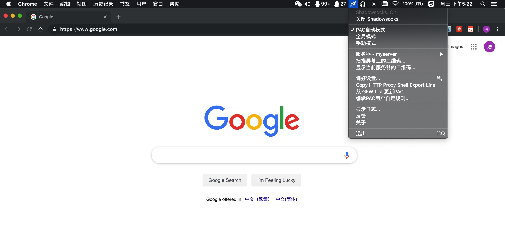
好了SSR -> 搞定！


## VPN(L2TP/IPSec)服务搭建

* 安装L2TP
```
cd ~ && mkdir vpn && cd vpn
yum install vim net-tools wget unzip -y #安装必要的工具
wget -O StackScript.zip http://files.cnblogs.com/files/think8848/StackScript.zip #下载安装脚本
unzip StackScript.zip #解压文件
chmod +x StackScript && ./StackScript #执行安装文件
```

* 修改PSK，将PSK后面的字符替换掉，这里在vpn客户端设置的时候叫做“预共享密钥”
```
vim /etc/ipsec.secrets
```


* 修改用户名和密码，将用户名和密码修改为自已想要的字符
```
vim /etc/ppp/chap-secrets
```

前面是用户名，后面是密码

* 重启IPsec和xl2tpd服务
```
systemctl restart ipsec xl2tpd
```

* 测试VPN
以Android为例：
进入系统设置 -> VPN -> 添加VPN -> 
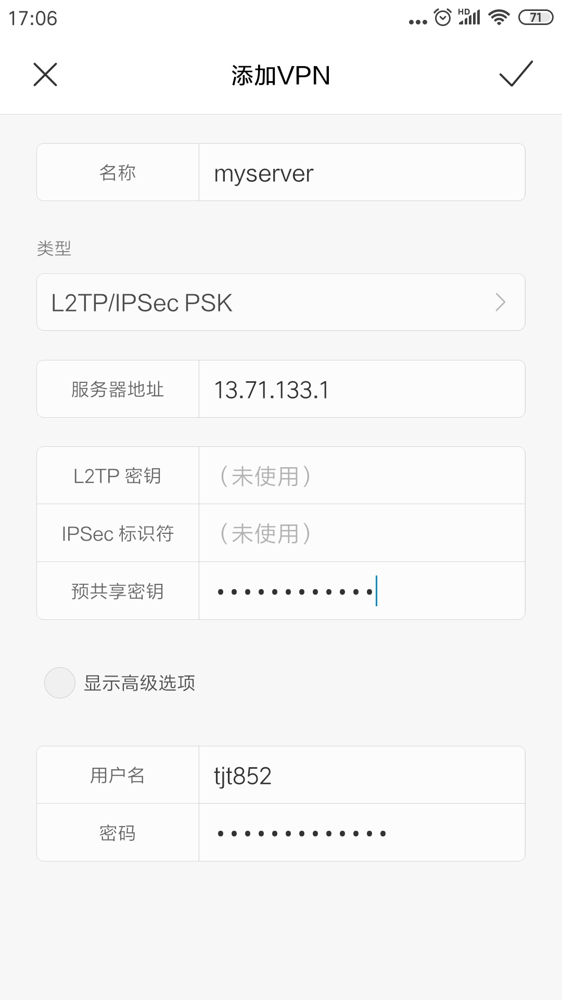
预共享密钥就是我们设置的 /etc/ipsec.secrets 文件里的 PSK 的值
用户名和密码就是 /etc/ppp/chap-secrets 文件里的值

我们来看下连接是否顺利：
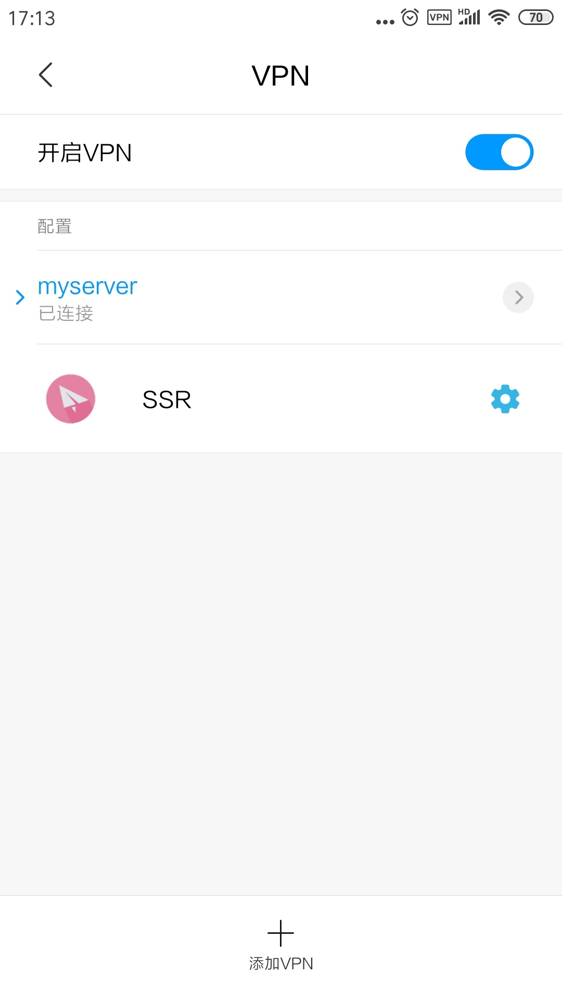
Perfect，完美连接，来试试看下外面的世界：


哈哈，日本，知道是什么原因了吗，嗦嘎！

* 添加VPN账户
1. 在 /etc/ppp/chap-secrets 文件中添加第二个用户，格式为： "username" l2tpd "password" * 
2. 执行 openssl passwd -1 "password" 得到一串MD5加密的字符串，如： $1$5NwpneO7$YD82DhVJxCQpQ4zahB1N01 
3. 复制这一段字符串到 /etc/ipsec.d/passwd 中，新行如下： username:$1$5NwpneO7$YD82DhVJxCQpQ4zahB1N01:xauth-psk ，红色是手工添加的。
4. systemctl restart ipsec xl2tpd 

-- 目前测试添加账户执行1和4部就行，2、3可以忽略，如遇到问题再加上即可！

